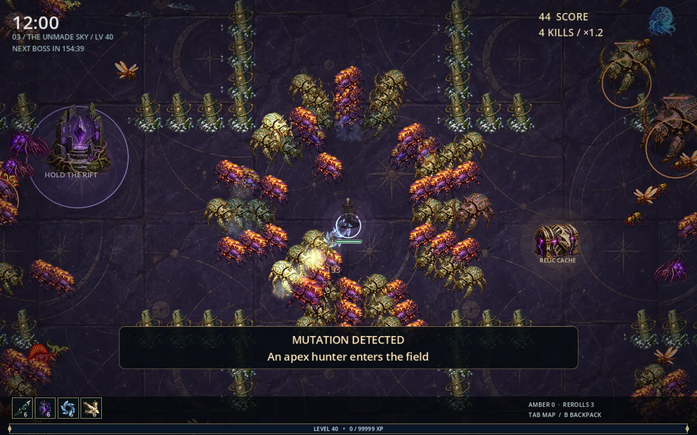
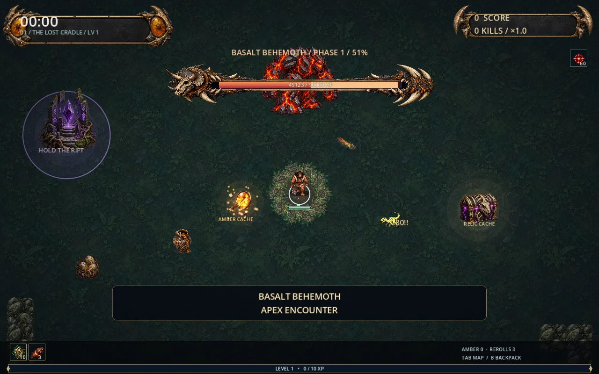
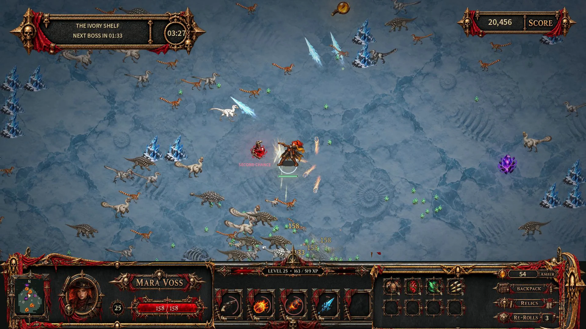
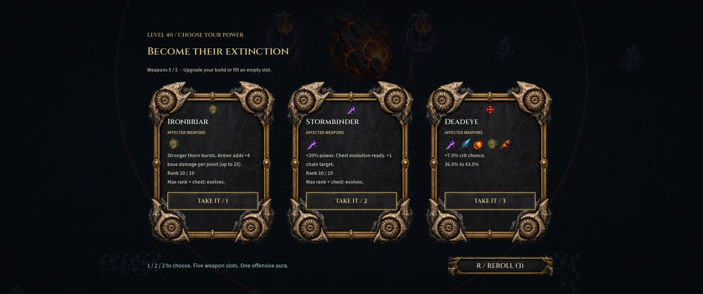

# Extinction Protocol
### The end of the world has a health bar.

**A prehistoric survivor roguelite. Guns, ancient fury, forbidden magic—and five weapon slots to turn them into something unreasonable.**

Public hobby playtest **0.9.0 · Lasting Expeditions**. Free to download and try.

> **An AI-assisted project, made for fun.** Extinction Protocol is a human-directed experiment built extensively with AI assistance, including programming, artwork, and procedural music and sound creation. It is an evolving hobby game, with human playtesting and creative direction.

[**Visit the game website**](https://actualraptor.github.io/extinction-protocol/)

[**Download the playtest**](https://github.com/actualraptor/extinction-protocol/releases/tag/v0.9.0) · [Report a bug](https://github.com/actualraptor/extinction-protocol/issues/new/choose) · [Browse the source](native/) · [Release notes](native/RELEASE-0.9.0.md)

## Play the test build

| Platform | Download | Status |
| --- | --- | --- |
| Windows x64 | [Windows ZIP](https://github.com/actualraptor/extinction-protocol/releases/download/v0.9.0/Extinction-Protocol-Windows-0.9.0.zip) | Tested native build |
| Linux x64 | [Linux archive](https://github.com/actualraptor/extinction-protocol/releases/download/v0.9.0/Extinction-Protocol-Linux-0.9.0-UNVERIFIED.tar.gz) | Exported; runtime compatibility still unverified |

On Windows, extract the ZIP and run **Extinction Protocol.exe**. No engine installation needed. For Linux instructions and feedback tips, see the [tester guide](native/PRIVATE-TEST-README.md).

**Move with WASD or arrow keys. Attacks fire automatically.** Choose upgrades, collect relics, defeat bosses, and enter their portals when you are ready to move deeper. Tab opens the map, B opens the backpack, and Escape pauses.

## Build something unreasonable

- **Five survivors:** gunslingers, primal fighters, and wielders of forbidden spells.
- **Three expedition maps:** each leads through three biome sections with escalating hordes and bosses.
- **23 base weapons:** fill five slots, improve your arsenal, and chase powerful evolutions and unions.
- **Progress between runs:** discover equipment and survivors, bank amber, and invest in permanent research.
- **Daily Challenge:** a shared daily seed and randomly chosen rewards. Make the build work and push into further circuits. Records currently stay on your computer.

| Face the ecosystem | Explore new frontiers |
| --- | --- |
|  |  |
| **Read the attacks. Earn the next rift.** | **New ground. New ways to die.** |

Screenshots show actual development gameplay; some include earlier interface versions.

## Store presentation preview

[**Download the illustrated store preview**](https://github.com/actualraptor/extinction-protocol/releases/download/v0.9.0/Extinction-Protocol-Store-Preview-0.9.0.zip), extract it, and open **index.html**. It includes a screenshot gallery and a Steam-style presentation of the game, and works offline apart from GitHub links.

The [live game website](https://actualraptor.github.io/extinction-protocol/) presents screenshots, downloads, and project information. The downloadable preview also works offline.

## Latest dispatch — 0.9.0

Boss attacks now clear when the boss falls, portals wait for rewards, and Daily circuits refresh their exploration and breakables. Progression gains recovery backups, while character selection and long HUD labels fit more reliably.

[Full patch notes](native/RELEASE-0.9.0.md) · [Download patch notes PNG](https://github.com/actualraptor/extinction-protocol/releases/download/v0.9.0/Extinction-Protocol-0.9.0-Patch-Notes.png)

## Help shape the next expedition

Use [Issues](https://github.com/actualraptor/extinction-protocol/issues) for bugs and feedback. Include your version, operating system, survivor, map, and what happened. A screenshot or run report helps reproduce the problem.

This is a hobby playtest, not a commercial Early Access release. Steam achievements, Cloud saves, and online leaderboards are not connected yet. Linux needs a real-device test.

For building and changing the game, see [DEVELOPING.md](DEVELOPING.md). Source is publicly viewable. No open-source license has been granted for the game; bundled third-party fonts retain their included OFL licenses.
